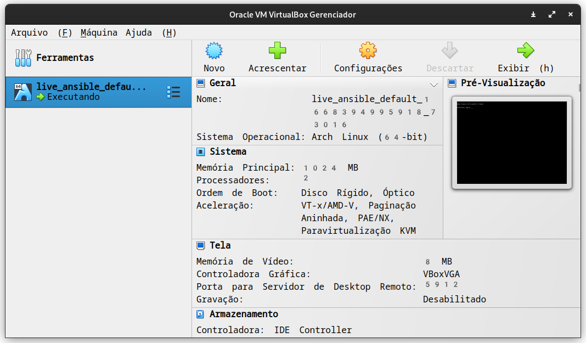
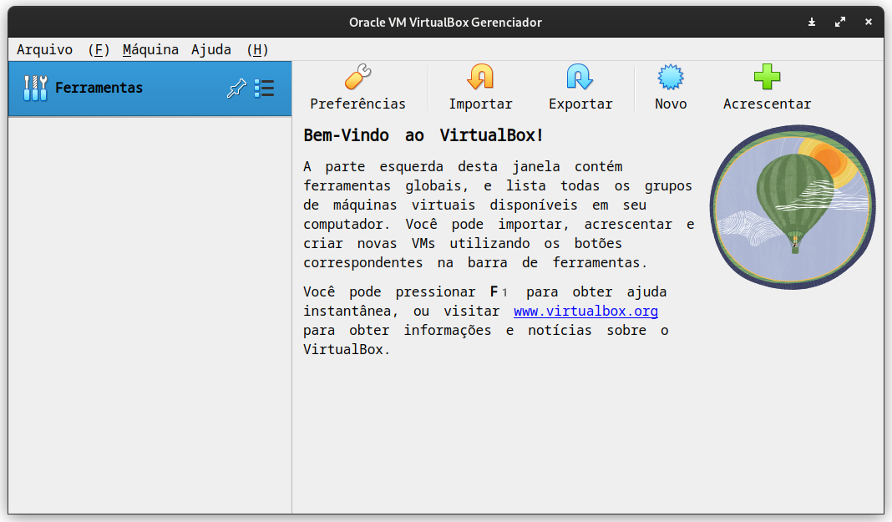
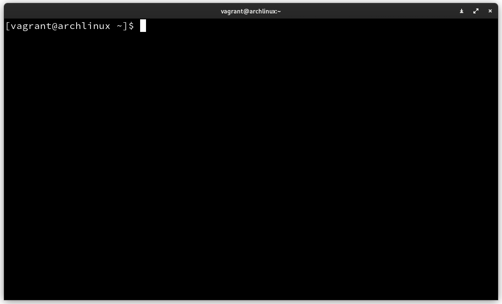
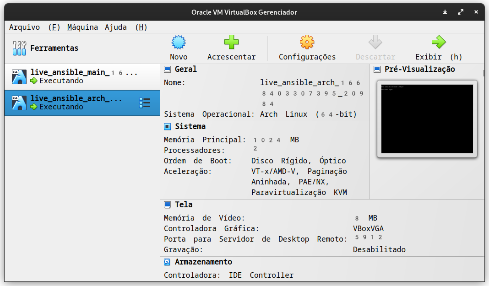

# Laboratório para Live de Python sobre Ansible :snake:

O objetivo desse repositório é ajudar você a construir um laboratório para aprender Ansible. Aqui você vai encontrar dicas e passos para configurar suas máquinas virtuais para construir seu ambiente.

A minha ideia principal com essa live é não depender de nenhum serviço de nuvem. Nem todas as pessoas podem pagar ou tem cartão de crédito para poder inserir mesmo nos planos gratuitos.

Para não depender de serviços externos, vamos usar máquinas virtuais com [virtualbox](https://www.virtualbox.org/) e vamos configurá-las usando [Vagrant](https://www.vagrantup.com/).

> Para melhor leitura acesse: https://ansible.dunossauro.live/

## Sumário

- [01 - Configuração do ambiente](#configuração-do-ambiente)
- [02 - O básico necessário sobre Vagrant](#básico-necessário-sobre-vagrant)
- [03 - Configuração do ansible](#configuração-do-ansible)
- [04 - Ansible básico](#ansible-básico)

# Configuração do ambiente

A primeira coisa que precisamos fazer é configurar o nosso host para instalação das máquinas virtuais. Para isso, precisamos instalar o `virtualbox` e o `vagrant`.


## Instalação do virtualbox

[Virtualbox](https://www.virtualbox.org/) é um software para criação de máquinas virtuais. E ele pode ser instalado em qualquer plataforma comum do mercado. Como Windows, Linux e MacOS.

> Caso você use o windows, as instalações podem ser feitas via [chocolatey](https://chocolatey.org/install#individual)

Você pode fazer o [download](https://www.virtualbox.org/wiki/Downloads) e instalar ou instalar usando o seu gerenciador de pacotes usando seu terminal preferido:

```bash
paru -S virtualbox                # Arch
choco install virtualbox          # Windows
sudo apt-get install virtualbox   # Ubuntu
```
- Usuários do Fedora Linux, recomendo a instalação do <a href="https://virt-manager.org/">Virtual Machine Manager</a>, que tem funcionamento semelhante ao virtualbox
```
sudo yum install virt-manager    # Fedora
```

## Instalação do vagrant

[Vagrant](https://www.vagrantup.com/) é um software de código aberto, escrito em [Ruby](https://www.ruby-lang.org/pt/) para construir ambientes de desenvolvimento usando um arquivo de configuração. Que pode ser reproduzido por qualquer pessoa que tenha acesso ao arquivo.

Abra seu terminal preferido e faça a instalação:

```bash
paru -S vagrant           # Arch
choco install vagrant     # Windows
sudo apt install vagrant  # Ubuntu
```

# Básico necessário sobre Vagrant

Vagrant é uma ferramenta para provisionamento de máquinas virtuais. Dizendo de forma simples, ele cria e configura máquinas virtuais usando um arquivo de configuração chamado `Vagrantfile`. Nesse arquivo podemos descrever como nossas vms serão configuradas.

Exemplo de um arquivo do Vagrant:

```ruby title="Vagrantfile" linenums="1" hl_lines="2"
Vagrant.configure("2") do |config|
  config.vm.box = "archlinux/archlinux"
end
```
A linha destacada é referente a um box do Vagrant.

## Vagrant boxes

Um box do vagrant no nosso contexto é uma máquina virtual pré-fabricada por uma pessoa. Existem milhares delas e elas podem ser acessadas no [Vagrant Cloud](https://app.vagrantup.com/boxes/search?provider=virtualbox)


Eu optei por usar máquina do [arch linux](https://archlinux.org/) para iniciarmos nossa configuração.

## Criando uma máquina virtual

Nosso primeiro passado é copiar o seguinte `Vagrantfile`:

```ruby title="Vagrantfile" linenums="1"
Vagrant.configure("2") do |config|
  config.vm.box = "archlinux/archlinux"
end
```

e colocar no diretório do nosso projeto. Que vamos inicialmente chamar de `ansible-lab`.

Dessa forma podemos criar nossa máquina virtual usando um simples comando:

```bash title="$ Execução no terminal"
vagrant up
```

O resultado deve ser algo parecido com isso:

```bash
Bringing machine 'default' up with 'virtualbox' provider...
==> default: Importing base box 'archlinux/archlinux'...
==> default: Matching MAC address for NAT networking...
==> default: Checking if box 'archlinux/archlinux' version '20221101.99038' is up to date...
==> default: Setting the name of the VM: ansible_lab_default_1668393945684_70462
==> default: Clearing any previously set network interfaces...
==> default: Preparing network interfaces based on configuration...
    default: Adapter 1: nat
==> default: Forwarding ports...
    default: 22 (guest) => 2222 (host) (adapter 1)
==> default: Booting VM...
==> default: Waiting for machine to boot. This may take a few minutes...
    default: SSH address: 127.0.0.1:2222
    default: SSH username: vagrant
    default: SSH auth method: private key
    default: Warning: Connection reset. Retrying...
    default: Warning: Remote connection disconnect. Retrying...
    default: 
    default: Vagrant insecure key detected. Vagrant will automatically replace
    default: this with a newly generated keypair for better security.
    default: 
    default: Inserting generated public key within guest...
    default: Removing insecure key from the guest if it's present...
    default: Key inserted! Disconnecting and reconnecting using new SSH key...
==> default: Machine booted and ready!
==> default: Checking for guest additions in VM...
==> default: Mounting shared folders...
    default: /vagrant => /home/z4r4tu5tr4/ansible_lab
```

E ele criará uma máquina virtual com archlinux no nosso virtualbox.

OBS: Esse comando pode demorar um pouco pois ele vai baixar um hd virtual do archlinux e instalar no seu virtualbox.



Agora que temos uma máquina virtual podemos partir para o segundo passo. Que é criar dois nós para trabalhar com ansible.

## Destruindo a máquina criada

Caso você tenha problemas ou queira simplesmente destruir a máquina virutal. O vagrant pode destruir de forma simples a vm e é isso que faremos agora.

```bash
vagrant destroy
```

Com isso podemos ter nosso ambiente limpo outra vez:


## Configurando mais de uma máquina virtual

Agora que entendemos a dinâmica de criação de vms do vagrant, podemos configurar duas máquinas para o ansible. Uma que vamos chamar de `main` que será de onde chamaremos o ansible e uma que será controlada por ele. Que se chamará somente `arch`.

Para isso, só precisamos alterar nosso `Vagrantfile`:

```ruby
Vagrant.configure("2") do |config|

  config.vm.define "main" do |main|
    main.vm.box = "archlinux/archlinux"
  end

  config.vm.define "arch" do |arch|
    arch.vm.box = "archlinux/archlinux"
  end

end
```

Agora temos duas máquinas virtuais. Ambas configuradas com archlinux. Porém cada uma tem uma função diferente na nossa rede.

O vagrant pode subir uma única vm ou as duas de uma vez:

```bash hl_lines="3"
vagrant up        # Inicia as duas vms
vagrant up arch   # Somente a máquina arch
vagrant up main   # Somente a máquina main (vamos escolher essa opção)
```


# Configuração do ansible

### Instalação do ansible

Agora que temos duas máquinas virtuais criadas. Podemos começar a instalação do ansible. A primeira coisa que devemos fazer é acessar a máquina controladora. Para isso podemos usar o `vagrant` para nos ajudar:

```bash
vagrant up main   # Iniciar a máquina controladora
vagrant ssh main  # Acessar o console da máquina controladora via ssh
```

E isso deve retornar o console dá maquina controladora no usuário `vagrant`:



O ansible tem seus pacotes nos repositórios de quase todas as distribuições linux. Então você pode instalar no seu sistema como quiser.

> Caso tenha dúvidas, o [link da documentação](https://docs.ansible.com/ansible/latest/installation_guide/intro_installation.html)

Formas de instalar em diversos sistemas.

```bash
sudo pacman -S ansible     # Arch
sudo apt install ansible   # Ubuntu
sudo dnf ansible           # Familia Redhat
```

O ansible também pode ser instalado via `pip`, porém a instalação é bastante trabalhosa.


Como eu escolhi que a máquina `main` fosse um archlinux, vamos seguir a configuração com ele. O primeiro passo que devemos fazer é atualizar a máquina para garantir que tudo funcione como o esperado:

```bash
sudo pacman -Syu  # Atualiza o sistema
```

Caso a senha senha perguntada. A senha padrão criada pelas máquinas virtuais do vagrant é `vagrant`.

Agora podemos rodar o comando para instalar o ansible:

```bash
sudo pacman -S ansible
```

Se tudo ocorrer como o esperado, podemos perguntar a versão do ansible ao sistema:

```bash
[vagrant@archlinux ~]$ ansible --version
ansible [core 2.14.0]
  config file = /etc/ansible/ansible.cfg
  configured module search path = ['/home/vagrant/.ansible/plugins/modules', '/usr/share/ansible/plugins/modules']
  ansible python module location = /usr/lib/python3.10/site-packages/ansible
  ansible collection location = /home/vagrant/.ansible/collections:/usr/share/ansible/collections
  executable location = /usr/bin/ansible
  python version = 3.10.8 (main, Nov  1 2022, 14:18:21) [GCC 12.2.0] (/usr/bin/python)
  jinja version = 3.1.2
  libyaml = True
```

Ele nos disse que está na versão `3.10.8`

### Instalação de um editor de textos

Recomendo fortemente que instale um editor de textos. Para facilitar a manutenção do sistema. Você pode usar o que quiser, porém, usarei o `nano` nesse tutorial. E para começarmos com pé direito no ansible, vamos fazer essa instalação usando-o e já partirmos para o nosso primeiro comando:

```bash
ansible localhost -a "sudo pacman -S nano --noconfirm"
```

E iremos receber esse resultado:

```bash
[WARNING]: No inventory was parsed, only implicit localhost is available
localhost | CHANGED | rc=0 >>
resolving dependencies...
looking for conflicting packages...

Packages (1) nano-6.4-1

Total Installed Size:  2.49 MiB

:: Proceed with installation? [Y/n] 
checking keyring...
checking package integrity...
loading package files...
checking for file conflicts...
checking available disk space...
:: Processing package changes...
installing nano...
:: Running post-transaction hooks...
(1/1) Arming ConditionNeedsUpdate...
```

O que significa que conseguimos fazer uma instalação na máquina local usando ansible. Isso é de mais.

#### Entendendo esse comando

Precisamos entender o básico do comando que executamos com ansible agora:

```bash
ansible localhost -a "sudo pacman -S nano --noconfirm"
```

Podemos dividi-lo em quatro partes:

- ansible: chama o ansible
- localhost: diz que a ação será executada no localhost
- -a: Argumentos que passaremos para o comando
- "sudo pacman -S nano --noconfirm": Os argumentos do comando

Quando só dizemos o nome do host `localhost` e colocamos os argumentos `-a` significa que ansible executará os argumentos como um comando de shell. Nesse caso `"sudo pacman -S nano --noconfirm"` é um comando de shell que serve para instalar o `nano`.


### Arquivo de inventário

Por padrão o arquivo de inventário das máquinas ficam no `/etc/ansible/hosts`. Vamos criar esse arquivo agora.

```bash
sudo nano /etc/ansible/hosts
```
É nesse arquivo que colocamos os endereços dos nós que serão controlados pelo ansible. O arquivo tem o seguinte formato:

```txt
[<nome_do_grupo>]
<endereço_da_maquina>  <opções>
```

Por exemplo, vamos cadastrar nossa outra vm `arch` que será controlado pelo `main`. Para isso, precisamos iniciar essa máquina virtual. Antes disso, temos que sair do ssh em `main`:

```bash
exit

logout
```

Agora voltamos a maquina principal. A máquina onde as máquinas virtuais foram instaladas. Para super o `arch`:

```bash
vagrant up arch
```

Com isso, agora devemos ter duas máquinas no nosso virtual box:



Com nossa vm já de pé, podemos enviar um comando para o vagrant nos dizer o endereço ip da máquina `arch`:

```bash
vagrant ssh arch -c "ip addr"
1: lo: <LOOPBACK,UP,LOWER_UP> mtu 65536 qdisc noqueue state UNKNOWN group default qlen 1000
    link/loopback 00:00:00:00:00:00 brd 00:00:00:00:00:00
    inet 127.0.0.1/8 scope host lo
       valid_lft forever preferred_lft forever
    inet6 ::1/128 scope host 
       valid_lft forever preferred_lft forever
2: eth0: <BROADCAST,MULTICAST,UP,LOWER_UP> mtu 1500 qdisc fq_codel state UP group default qlen 1000
    link/ether 08:00:27:fa:60:9b brd ff:ff:ff:ff:ff:ff
    altname enp0s3
    inet 10.0.2.15/24 metric 1024 brd 10.0.2.255 scope global dynamic eth0
       valid_lft 86241sec preferred_lft 86241sec
    inet6 fe80::a00:27ff:fefa:609b/64 scope link 
       valid_lft forever preferred_lft forever
```

Podemos ver que o IP associado a `arch` é `10.0.2.15`. Que é o endereço que colocaremos no nosso inventário.

Agora vamos voltar a nossa máquina `main` via ssh:

```bash
vagrant ssh main
```

E vamos alterar nosso arquivo `/etc/ansible/hosts` dessa forma e com o comando `sudo nano /etc/ansible/hosts`:

```txt
[arch]
10.0.2.15
```

Dessa forma dissemos ao ansible que existe um grupo chamado `arch`, uma dessas máquinas tem o ip `10.0.2.15`. Assim, podemos enviar comandos para o grupo `arch`.

### Primeiro comando remoto

E podemos checar enviando um `ping` para a vm `arch` usando o seguinte comando `ansible arch -m ping`:

```bash
ansible arch -m ping

The authenticity of host '10.0.2.15 (10.0.2.15)' can't be established.
ED25519 key fingerprint is SHA256:FyOy2yTlOHSLJXVF+lmYjPywdfmQprApMWrsQ7KxUlI.
This host key is known by the following other names/addresses:
    ~/.ssh/known_hosts:1: localhost
Are you sure you want to continue connecting (yes/no/[fingerprint])? yes
10.0.2.15 | UNREACHABLE! => {
    "changed": false,
    "msg": "Failed to connect to the host via ssh: Warning: Permanently added '10.0.2.15' (ED25519) to the list of known hosts.\r\nvagrant@10.0.2.15: Permission denied (publickey,password).",
    "unreachable": true
}
```

Um erro ocorreu por conta da segurança. O SSH da vm `arch` não permitiu que o ansible fizesse a conexão. Para isso precisamos trocar chaves entre os hosts para que aconteça de maneira segura.

## Troca de chaves SSH

Vamos voltar ao shell e digitar os seguintes comandos:

```bash
ssh-keygen  # para gerar uma chave ssh para nossa vm `main`
ssh-copy-id vagrant@10.0.2.15  # Para copiar a chave de `main` para `arch`
```

Se executarmos o ping novamente obteremos sucesso:

```bash
ansible arch -m ping

10.0.2.15 | SUCCESS => {
    "ansible_facts": {
        "discovered_interpreter_python": "/usr/bin/python3.10"
    },
    "changed": false,
    "ping": "pong"
}

```

Isso significa que a comunicação com os dois nós está acontecendo de maneira correta. Mas, faltou entender o que o comando `ansible arch -m ping` significa:

- ansible: Chama o ansible
- arch: O nome do grupo do inventário
- -m: Significa que vamos chamar um módulo
- ping: Módulo para checar se o grupo está respondendo

# Ansible básico
