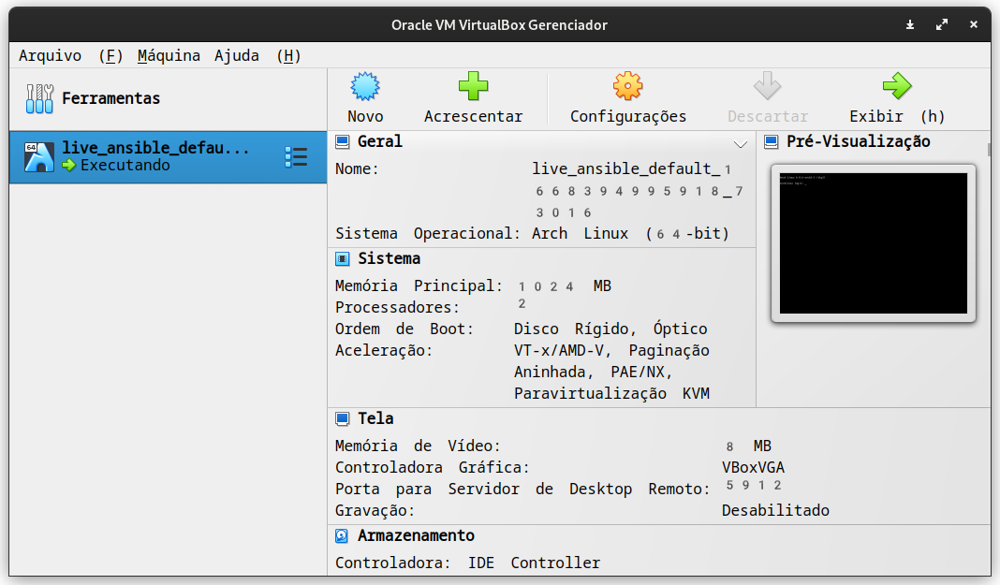
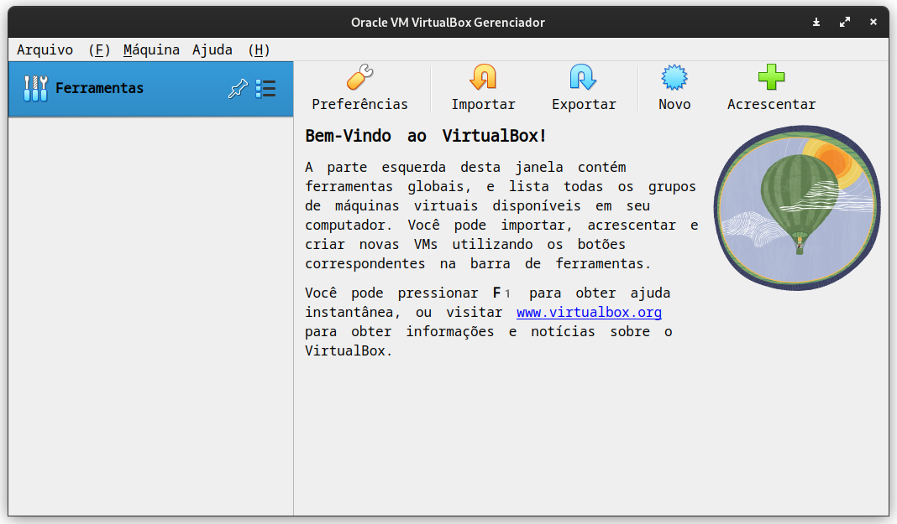

# Básico necessário sobre Vagrant

Vagrant é uma ferramenta para provisionamento de máquinas virtuais. Dizendo de forma simples, ele cria e configura máquinas virtuais usando um arquivo de configuração chamado `Vagrantfile`. Nesse arquivo podemos descrever como nossas vms serão configuradas.

Exemplo de um arquivo do Vagrant:

```ruby title="Vagrantfile" linenums="1" hl_lines="2"
Vagrant.configure("2") do |config|
  config.vm.box = "archlinux/archlinux"
end
```
A linha destacada é referente a um box do Vagrant.

## Vagrant boxes

Um box do vagrant no nosso contexto é uma máquina virtual pré-fabricada por uma pessoa. Existem milhares delas e elas podem ser acessadas no [Vagrant Cloud](https://app.vagrantup.com/boxes/search?provider=virtualbox)


Eu optei por usar máquina do [arch linux](https://archlinux.org/) para iniciarmos nossa configuração.

## Criando uma máquina virtual

Nosso primeiro passado é copiar o seguinte `Vagrantfile`:

```ruby title="Vagrantfile" linenums="1"
Vagrant.configure("2") do |config|
  config.vm.box = "archlinux/archlinux"
end
```

e colocar no diretório do nosso projeto. Que vamos inicialmente chamar de `ansible-lab`.

Dessa forma podemos criar nossa máquina virtual usando um simples comando:

```bash title="$ Execução no terminal"
vagrant up
```

O resultado deve ser algo parecido com isso:

```bash
Bringing machine 'default' up with 'virtualbox' provider...
==> default: Importing base box 'archlinux/archlinux'...
==> default: Matching MAC address for NAT networking...
==> default: Checking if box 'archlinux/archlinux' version '20221101.99038' is up to date...
==> default: Setting the name of the VM: ansible_lab_default_1668393945684_70462
==> default: Clearing any previously set network interfaces...
==> default: Preparing network interfaces based on configuration...
    default: Adapter 1: nat
==> default: Forwarding ports...
    default: 22 (guest) => 2222 (host) (adapter 1)
==> default: Booting VM...
==> default: Waiting for machine to boot. This may take a few minutes...
    default: SSH address: 127.0.0.1:2222
    default: SSH username: vagrant
    default: SSH auth method: private key
    default: Warning: Connection reset. Retrying...
    default: Warning: Remote connection disconnect. Retrying...
    default: 
    default: Vagrant insecure key detected. Vagrant will automatically replace
    default: this with a newly generated keypair for better security.
    default: 
    default: Inserting generated public key within guest...
    default: Removing insecure key from the guest if it's present...
    default: Key inserted! Disconnecting and reconnecting using new SSH key...
==> default: Machine booted and ready!
==> default: Checking for guest additions in VM...
==> default: Mounting shared folders...
    default: /vagrant => /home/z4r4tu5tr4/ansible_lab
```

E ele criará uma máquina virtual com archlinux no nosso virtualbox.

OBS: Esse comando pode demorar um pouco pois ele vai baixar um hd virtual do archlinux e instalar no seu virtualbox.



Agora que temos uma máquina virtual podemos partir para o segundo passo. Que é criar dois nós para trabalhar com ansible.

## Destruindo a máquina criada

Caso você tenha problemas ou queira simplesmente destruir a máquina virutal. O vagrant pode destruir de forma simples a vm e é isso que faremos agora.

```bash
vagrant destroy
```

Com isso podemos ter nosso ambiente limpo outra vez:


## Configurando mais de uma máquina virtual

Agora que entendemos a dinâmica de criação de vms do vagrant, podemos configurar duas máquinas para o ansible. Uma que vamos chamar de `main` que será de onde chamaremos o ansible e uma que será controlada por ele. Que se chamará somente `arch`.

Para isso, só precisamos alterar nosso `Vagrantfile`:

```ruby
Vagrant.configure("2") do |config|

  config.vm.define "main" do |main|
    main.vm.box = "archlinux/archlinux"
  end

  config.vm.define "arch" do |arch|
    arch.vm.box = "archlinux/archlinux"
  end

end
```

Agora temos duas máquinas virtuais. Ambas configuradas com archlinux. Porém cada uma tem uma função diferente na nossa rede.

O vagrant pode subir uma única vm ou as duas de uma vez:

```bash hl_lines="3"
vagrant up        # Inicia as duas vms
vagrant up arch   # Somente a máquina arch
vagrant up main   # Somente a máquina main (vamos escolher essa opção)
```
