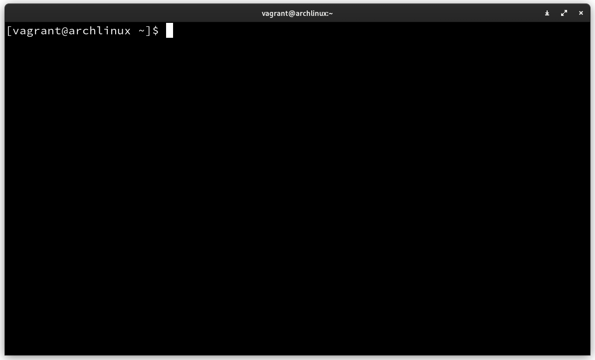
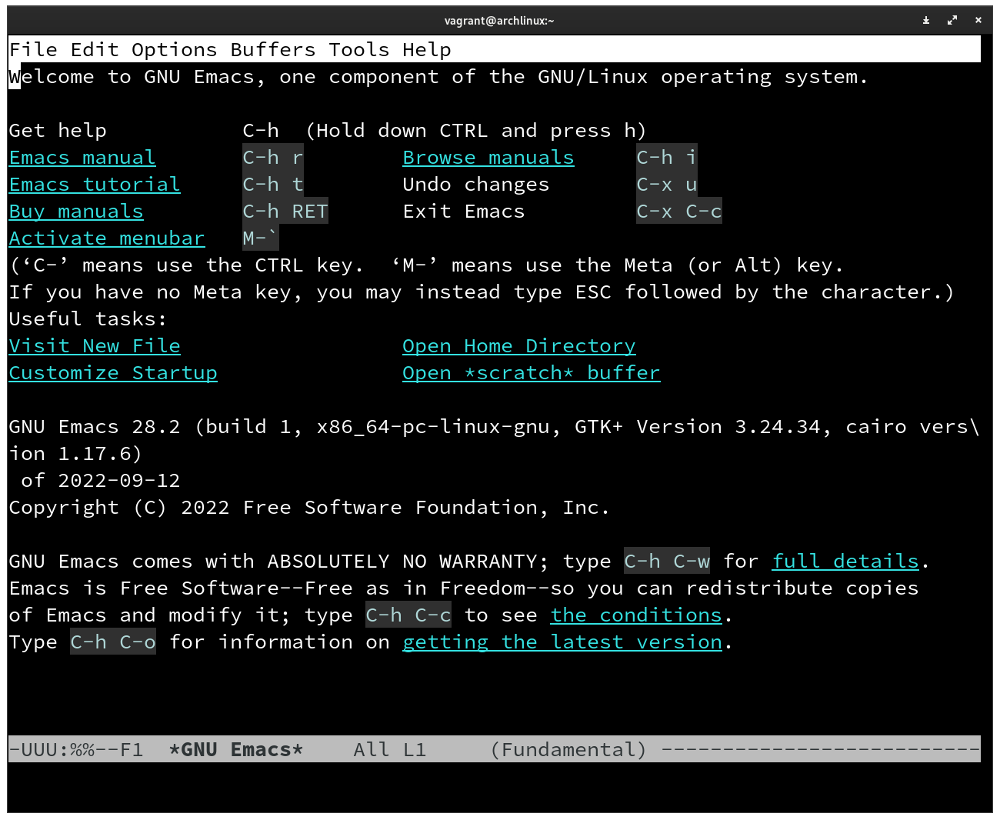
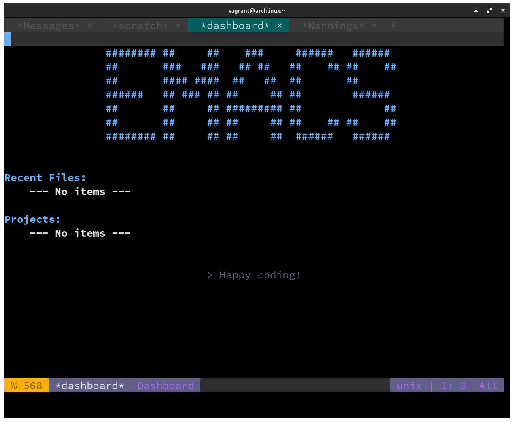

# Ansible básico

[Ansible](https://www.ansible.com/) é um grupo de ferramentas de código aberto construídas em python. O objetivo do Ansible é automatizar tarefas de diversas naturezas. Foi originalmente escrito por Michael DeHaan em 2012 e foi comprado pela Red Hat em 2015.

!!! tipo "curiosidade"
	A palavra Ansible foi cunhada por `Ursula K. Le Guin` no livro `O mundo de Rocannon`
	
	{ width="100" }
	
	No livro existem diversos mundos e viajantes navegam na velocidade da luz. Ansible é um dispositivo que de comunicação instantânea pelo universo.

## Automações

Quando falamos sobre Ansible, estamos falando sobre qualquer tipo de automação em máquinas. Alguns exemplos comuns são:

- Provisionamento de ambientes
- Gerenciamento de configuração
- Implantação de aplicativos

Entre outras coisas que podemos fazer com o ferramental

### Provisionamento

Provisionamento é o processo de preparar um dispositivo para que ele possa entrar em produção. Não só exatamente a respeito do hardware, mas a preparação do sistema operacional a escolha dos aplicativos instalados e etc...

Vimos nesse pequeno tutorial outra ferramenta de provisionamento, o Vagrant, que consegue montar a máquina virtual, fornecer a instalação do sistema operacional. A parte que envolve o ansible é mais referente a configuração dos pacotes instalados, a instalação dos softwares necessários para colocar uma máquina, geralmente um servidor, em funcionamento.

### Gerenciamento de configuração

O gerenciamento de configuração é uma das partes do provisionamento, porém com foco e configurar as aplicações instaladas no sistema operacional para que ele se comporte como esperado em produção.

### Implantação de aplicativos

Após toda a fase de instalação e configuração do ambiente e do sistema operacional, podemos colocar nossos aplicativos para serem executados nessas máquinas.

### Um exemplo

Vamos pensar que fizemos uma aplicação web com Python. Para que essa aplicação seja usada em um servidor o servidor tem que atender diversos requisitos para executar a nossa aplicação. Independentemente da opção que você escolha para fazer o deploy dela.

De forma simples, temos que instalar o python na versão correta, fazer a instalação das bibliotecas necessárias, configurar um banco de dados. Fazer com que a aplicação e o banco de dados conversem.

Para que isso ocorra na nuvem, por exemplo, alguém deve ter provisionado um sistema base, como um [ubuntu linux](https://ubuntu.com/), geralmente usando algum sistema de virtualização. Como fizemos aqui com VirtualBox, porém em uma escala muito maior. Essa máquina tem que ter ao menos um serviço de [SSH](https://pt.wikipedia.org/wiki/Secure_Shell) configurado para que possamos acessar esse computador do conforto da nossa casa.

É nesse contexto que o Ansible entra. Pegamos um sistema operacional limpo e iniciamos as nossas configurações e instalações para que nossa aplicação possa ser executada nesse servidor.

## Instalação do ansible

Agora que temos duas máquinas virtuais criadas. Podemos começar a instalação do ansible. A primeira coisa que devemos fazer é acessar a máquina controladora. Para isso podemos usar o `vagrant` para nos ajudar:

```bash title="$ Execução no terminal"
vagrant up main   # Iniciar a máquina controladora
vagrant ssh main  # Acessar o console da máquina controladora via ssh
```

E isso deve retornar o console dá maquina controladora no usuário `vagrant`:

{ width="500" }

O ansible tem seus pacotes nos repositórios de quase todas as distribuições linux. Então você pode instalar no seu sistema como quiser.

> Caso tenha dúvidas, o [link da documentação](https://docs.ansible.com/ansible/latest/installation_guide/intro_installation.html)

Formas de instalar em diversos sistemas.

```bash title="$ Execução no terminal"
sudo pacman -S ansible     # Arch
sudo apt install ansible   # Ubuntu
sudo dnf ansible           # Familia Redhat
```

O ansible também pode ser instalado via `pip`, porém a instalação é bastante trabalhosa.


Como eu escolhi que a máquina `main` fosse um archlinux, vamos seguir a configuração com ele. O primeiro passo que devemos fazer é atualizar a máquina para garantir que tudo funcione como o esperado:

```bash
sudo pacman -Syu  # Atualiza o sistema
```

Caso a senha senha perguntada. A senha padrão criada pelas máquinas virtuais do vagrant é `vagrant`.

Agora podemos rodar o comando para instalar o ansible:

```bash title="$ Execução no terminal"
sudo pacman -S ansible
```

Se tudo ocorrer como o esperado, podemos perguntar a versão do ansible ao sistema:

```bash title="$ Execução no terminal"
[vagrant@archlinux ~]$ ansible --version
ansible [core 2.14.0]
  config file = /etc/ansible/ansible.cfg
  configured module search path = ['/home/vagrant/.ansible/plugins/modules', '/usr/share/ansible/plugins/modules']
  ansible python module location = /usr/lib/python3.10/site-packages/ansible
  ansible collection location = /home/vagrant/.ansible/collections:/usr/share/ansible/collections
  executable location = /usr/bin/ansible
  python version = 3.10.8 (main, Nov  1 2022, 14:18:21) [GCC 12.2.0] (/usr/bin/python)
  jinja version = 3.1.2
  libyaml = True
```

Ele nos disse que está na versão `3.10.8`

## Um pouco de ansible na prática

O ansible foi pensado para que pudéssemos automatizar uma tarefa de qualquer natureza. Para isso basta ter o ansible instalado na sua máquina e chamá-lo via linha de comando.

### Instalação de um pacote

Por exemplo, vamos supor que no nosso ambiente é imprescindível que o editor de texto [GNU/Emacs](https://www.gnu.org/software/emacs/) esteja instalado (para mim costuma ser). Então podemos usar o ansible para instalar o Emacs no nosso computador pessoal:


```bash title="$ Execução no terminal"
ansible localhost -m package -a "name=emacs state=present" -b
```

Com esse simples comando, temos o GNU/Emacs instalado nesse computador. Mas, o que realmente aconteceu aqui?

| Fragmento do comando | O que faz? |
| -------------------- | ---------- |
| ansible              | Invoca o ansible                                  |
| localhost            | Diz qual máquina será afetada pelo comando        |
| -m                   | Diz que vamos chamar um módulo                    |
| package                     | `package` é o nome do módulo que vamos chamar     |
| -a                          | Indica que vamos passar argumentos para o módulo  |
| "name=emacs state=present"  | Argumentos do módulo                                    |
| -b                          | Diz ao Ansible que o comando será executado como `root` |

O módulo [package](https://docs.ansible.com/ansible/2.9/modules/package_module.html#package-module) é um dos muitos módulos ofertados pelo Ansible. Você pode ver uma lista completa aqui nesse [link](https://docs.ansible.com/ansible/2.9/modules/list_of_all_modules.html). O que dissemos porém é: "Modulo `package` garanta que o pacote `emacs` esteja `presente` no sistema em que for executado".

Podemos checar no terminal:

```bash title="$ Execução no terminal"
emacs
```

{ width="500" }

!!! error "Caso tenha ficado preso"
	Para sair do emacs tecle Alt+x e em seguida digite `kill-emacs` e você terá saído do emacs :heart:

### Configuração do pacote

Embora o GNU/Emacs esteja instalado no meu sistema. Ele ainda não foi configurado da maneira que eu gostaria. Não tem as minhas cores, os meus atalhos e para isso precisamos baixar meu arquivo de configuração que está no [github.com/dunossauro/dotfiles](https://github.com/dunossauro/dotfiles).

Para isso, podemos contar com outro módulo disponível no Ansible, o [git](https://docs.ansible.com/ansible/2.9/modules/git_module.html#git-module). Então, vamos baixar as minhas configurações:

```bash title="$ Execução no terminal"
ansible localhost -m git \
    -a "repo=https://github.com/dunossauro/dotfiles.git dest=config_files"
```

E com isso, obtivemos um erro:

```bash title="Resposta do terminal"
localhost | FAILED! => {
    "changed": false,
    "msg": "Failed to find required executable \"git\" in paths: /usr/local/sbin:/usr/local/bin:/usr/bin:/sbin:/usr/sbin"
}
```

O ansible não conseguiu achar o `git` no nosso sistema, ele precisa ser instalado. Como já conhecemos o módulo package, será fácil. Só dizer ao módulo `package` que `git` deve estar `present`:

```bash title="$ Execução no terminal"
ansible localhost -m package -a "name=git state=present" -b
```

Após instalar o git, podemos testar nosso módulo de git outra vez:

```bash title="$ Execução no terminal"
ansible localhost -m git \
    -a "repo=https://github.com/dunossauro/dotfiles.git dest=config_files"
```

```bash title="Resposta do terminal"
localhost | CHANGED => {
    "after": "8ff42a43ede85403b6b85c0bab9a1a4fe0d73544",
    "before": null,
    "changed": true
}
```

`CHANGED`, significa que uma ação foi executada e agora temos os arquivos no nosso computador na pasta `dest` que passamos como argumento.

```bash title="$ Execução no terminal"
ls config_files/.emacs.d
init.el
```

Agora só falta colocar a nossa configuração no lugar certo. O diretório `~/.emacs.d/`. Para isso podemos contar com outro módulo do [copy](https://docs.ansible.com/ansible/2.9/modules/copy_module.html#copy-module):

```bash title="$ Execução no terminal"
ansible localhost -m copy -a "dest='/home/vagrant/' src='/home/vagrant/config_files/.emacs.d'"
```
Após isso, podemos abrir o emacs novamente:

```bash title="$ Execução no terminal"
emacs
```

> Pode demorar um pouco para as configurações serem baixadas e instaladas da internet.

E temos o emacs com as minhas configurações:

{ width="500" }

!!! error "Caso tenha ficado preso OUTRA VEZ"
	Para sair do emacs tecle Alt+x e em seguida digite `kill-emacs` e você terá saído do emacs :heart:
