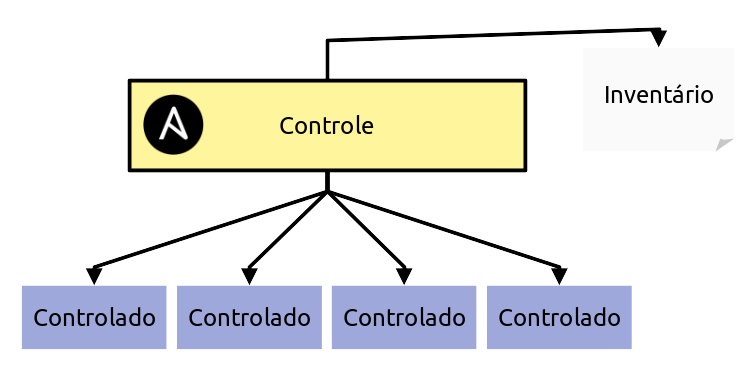

# Entendendo a estrutura do ansible

Embora até o momento executamos o ansible somente em uma máquina local. E confesso que já pode ser bastante útil para padronizar suas configurações após uma formatação, por exemplo. O Ansible brilha quando estamos falando de rede.

## Arquitetura de uso do ansible

O Ansible distingue as máquinas em duas categorias. O nó de controle, onde o ansible está instalado e os nós controlados. Que máquinas em que o ansible pode se comunicar via SSH e executar os comandos:

{: .center .shadow-png}

Dessa forma podemos partir do nó de {==Controle==} e enviar rotinas de automação para todos os nós {==Controlados==}.

Para isso o ansible conta com um arquivo de inventário. Um lugar onde todas as máquinas que serão controladas pelo controlador devem ser registradas.

### Arquivo de inventário

Por padrão o arquivo de inventário das máquinas ficam no `/etc/ansible/hosts`. Vamos criar esse arquivo agora.

```bash title="$ Execução no terminal" 
# instalação do Nano, não vou obrigar ninguém a usar o Emacs ;)
ansible localhost -m package -a "name=emacs state=present" -b

sudo nano /etc/ansible/hosts
```

É nesse arquivo que colocamos os endereços dos nós que serão controlados pelo ansible. O arquivo tem o seguinte formato:

```txt
[<nome_do_grupo>]
<endereço_da_maquina>  <opções>
```

Por exemplo, vamos cadastrar nossa outra vm `arch` que será controlado pelo `main`. Para isso, precisamos iniciar essa máquina virtual. Antes disso, temos que sair do ssh em `main`:

```bash title="$ Execução no terminal"
exit
```

Agora voltamos a maquina principal. A máquina onde as máquinas virtuais foram instaladas. Vamos iniciar nossa outra máquina. O `ubuntu`:

```bash
vagrant up ubuntu
```

Com isso, agora devemos ter duas máquinas no nosso virtual box:

[AA] - Mudar essa imagem


Com nossa vm já de pé, podemos enviar um comando para o vagrant nos dizer o endereço ip da máquina `ubuntu`:

```bash title="$ Execução no terminal"
vagrant ssh ubuntu -c "ip addr"
1: lo: <LOOPBACK,UP,LOWER_UP> mtu 65536 qdisc noqueue state UNKNOWN group default qlen 1000
    link/loopback 00:00:00:00:00:00 brd 00:00:00:00:00:00
    inet 127.0.0.1/8 scope host lo
       valid_lft forever preferred_lft forever
    inet6 ::1/128 scope host 
       valid_lft forever preferred_lft forever
2: eth0: <BROADCAST,MULTICAST,UP,LOWER_UP> mtu 1500 qdisc fq_codel state UP group default qlen 1000
    link/ether 08:00:27:fa:60:9b brd ff:ff:ff:ff:ff:ff
    altname enp0s3
    inet {==10.0.2.15==}/24 metric 1024 brd 10.0.2.255 scope global dynamic eth0
       valid_lft 86241sec preferred_lft 86241sec
    inet6 fe80::a00:27ff:fefa:609b/64 scope link 
       valid_lft forever preferred_lft forever
```

Podemos ver que o IP associado a `ubuntu` é `10.0.2.15`. Que é o endereço que colocaremos no nosso inventário.

Agora vamos voltar a nossa máquina `main` via ssh:

```bash title="$ Execução no terminal"
vagrant ssh main
```

E vamos alterar nosso arquivo `/etc/ansible/hosts` dessa forma e com o comando `sudo nano /etc/ansible/hosts`:

```txt title="/etc/ansible/hosts" linenums="1"
[ubuntu]
10.0.2.15
```

Dessa forma dissemos ao ansible que existe um grupo chamado `ubuntu`, uma dessas máquinas tem o ip `10.0.2.15`. Assim, podemos enviar comandos para o grupo `ubuntu`.

### Primeiro comando remoto

E podemos checar enviando um `ping` para a vm `ubuntu` usando o seguinte comando `ansible ubuntu -m ping`:

```bash title="$ Execução no terminal"
ansible ubuntu -m ping

The authenticity of host '10.0.2.15 (10.0.2.15)' can't be established.
ED25519 key fingerprint is SHA256:FyOy2yTlOHSLJXVF+lmYjPywdfmQprApMWrsQ7KxUlI.
This host key is known by the following other names/addresses:
    ~/.ssh/known_hosts:1: localhost
Are you sure you want to continue connecting (yes/no/[fingerprint])? yes
10.0.2.15 | UNREACHABLE! => {
    "changed": false,
    "msg": "Failed to connect to the host via ssh: Warning: Permanently added '10.0.2.15' (ED25519) to the list of known hosts.\r\nvagrant@10.0.2.15: Permission denied (publickey,password).",
    "unreachable": true
}
```

Um erro ocorreu por conta da segurança. O SSH da vm `ubuntu` não permitiu que o ansible fizesse a conexão. Para isso precisamos trocar chaves entre os hosts para que aconteça de maneira segura.

## Troca de chaves SSH

Vamos voltar ao shell e digitar os seguintes comandos:

```bash title="$ Execução no terminal"
ssh-keygen  # para gerar uma chave ssh para nossa vm `main`
ssh-copy-id vagrant@10.0.2.15  # Para copiar a chave de `main` para `ubuntu`
```

Se executarmos o ping novamente obteremos sucesso:

```bash title="$ Execução no terminal"
ansible arch -m ping

10.0.2.15 | SUCCESS => {
    "ansible_facts": {
        "discovered_interpreter_python": "/usr/bin/python3.10"
    },
    "changed": false,
    "ping": "pong"
}
```

Isso significa que a comunicação com os dois nós está acontecendo de maneira correta. Mas, faltou entender o que o comando `ansible ubuntu -m ping` significa:

- ansible: Chama o ansible
- ubuntu: O nome do grupo do inventário
- -m: Significa que vamos chamar um módulo
- ping: Módulo para checar se o grupo está respondendo

## Repetindo o processo para mais uma máquina

Agora que já entendemos o que temos que fazer. Podemos adicionar mais uma máquina virtual ao nosso ambiente. Vamos criar mais um `arch` para que seja controlado pelo ansible:

```ruby title="Vagrantfile" linenums="1"
Vagrant.configure("2") do |config|

  config.vm.define "main" do |main|
    main.vm.box = "archlinux/archlinux"
  end

  config.vm.define "ubuntu" do |ubuntu|
    ubuntu.vm.box = "ubuntu/focal64"
  end

  config.vm.define "arch" do |arch|
    main.vm.box = "archlinux/archlinux"
  end

end
```

Agora podemos dar `up` nessa nova máquina:

```bash title="$ Execução no terminal"
exit  # caso esteja no conectado no main

vagrant up arch
```

Pegamos o endereço de ip:

```bash title="$ Execução no terminal"
vagrant ssh arch -c "ip addr"
1: lo: <LOOPBACK,UP,LOWER_UP> mtu 65536 qdisc noqueue state UNKNOWN group default qlen 1000
    link/loopback 00:00:00:00:00:00 brd 00:00:00:00:00:00
    inet 127.0.0.1/8 scope host lo
       valid_lft forever preferred_lft forever
    inet6 ::1/128 scope host 
       valid_lft forever preferred_lft forever
2: eth0: <BROADCAST,MULTICAST,UP,LOWER_UP> mtu 1500 qdisc fq_codel state UP group default qlen 1000
    link/ether 08:00:27:fa:60:9b brd ff:ff:ff:ff:ff:ff
    altname enp0s3
    inet {==10.0.2.16==}/24 metric 1024 brd 10.0.2.255 scope global dynamic eth0
       valid_lft 86241sec preferred_lft 86241sec
    inet6 fe80::a00:27ff:fefa:609b/64 scope link 
       valid_lft forever preferred_lft forever
```

Adicionamos esse ip no inventário da máquina controladora:

```text title="/etc/ansible/hosts" hl_lines="4 5" linenums="1"
[ubuntu]
10.0.2.15

[arch]
10.0.2.16
```

Fazemos a troca de chaves SSH, para que o Controlador se comunique de forma segura com o `arch`:

```bash title="$ Execução no terminal"
ssh-copy-id vagrant@10.0.2.16  # Para copiar a chave de `main` para `arch`
```

Com isso temos dois grupos no nó de controle. O `ubuntu` e o `arch`. Podemos criar um grupo novo também para juntar todos os linux e disparar comandos que funcionem nas duas máquinas ao mesmo tempo:


```text title="/etc/ansible/hosts" hl_lines="7 8 9" linenums="1"
[ubuntu]
10.0.2.15

[arch]
10.0.2.16

[linux]
10.0.2.15
10.0.2.16
```

Dessa forma, podemos chamar o módulo `ping` para todos os nós em um grupo só:

```bash title="$ Execução no terminal"
ansible linux -m ping
```

Caso tudo esteja configurado corretamente. Iremos obter sucesso em ambos os pings. O que significa que o comando foi executado com sucesso nas duas máquinas.

## Instalando um pacote em dois nós ao mesmo tempo

Vamos iniciar uma configuração simples e que já rodamos no nó controlador. Meu objetivo, porém, é mostrar a vocês o poder do ansible de forma simples:


```bash title="$ Execução no terminal"
ansible linux -m package -a "name=nginx state=present" -b
```

Dessa forma acabamos de instalar o servidor web [Nginx](https://nginx.org/) nas nossas duas máquinas virtuais ao mesmo tempo. Uma coisa importante de notar e que diferencia de uma forma simplória de instalação. É que não foi preciso dizer nem ao menos qual o gerenciador de pacotes que é usado em cada distribuição. O módulo `package` entende isso por padrão e usa o gerenciador da distribuição por baixo dos panos.


Com isso, podemos conhecer outro módulo. O módulo do [systemd](https://docs.ansible.com/ansible/latest/collections/ansible/builtin/systemd_module.html) e com ele podemos dizer que queremos dar start no processo do Nginx:


```bash title="$ Execução no terminal"
ansible linux -m systemd -a "name=nginx state=started" -b
```

E volá, instalamos o Nginx em duas máquinas e subimos o server somente usando comandos simples e sem a preocupação de ter de entender coisas específicas de sistema.

Vamos ver se o serviço subiu da forma correta? Para isso vou me aproveitar do ansible para instalar o httpie no sistema para fazer essa requisição no nó controlador. Porém não quero fazer essa instalação sujando o ambiente. Então, vamos instalar o `pipx`


```bash title="$ Execução no terminal"
ansible localhost -m package -a "name=python-pipx state=present" -b
```

Agora com o `pipx` instalado, podemos usar ele via módulo `shell` para instalar o httpie:

```bash title="$ Execução no terminal"
ansible localhost -m shell -a "pipx install httpie"
```

E agora, finalmente, podemos checar se ambos os serviços foram startados corretamente pelo ansible:

```bash title="$ Execução no terminal"
http 10.0.2.15
http 10.0.2.16
```

Embora tudo tenha sido executado de forma incrível. Ainda considero chato de mais ficar chamando o ansible no terminal o tempo todo. Então, precisamos de uma forma de melhorar isso.
