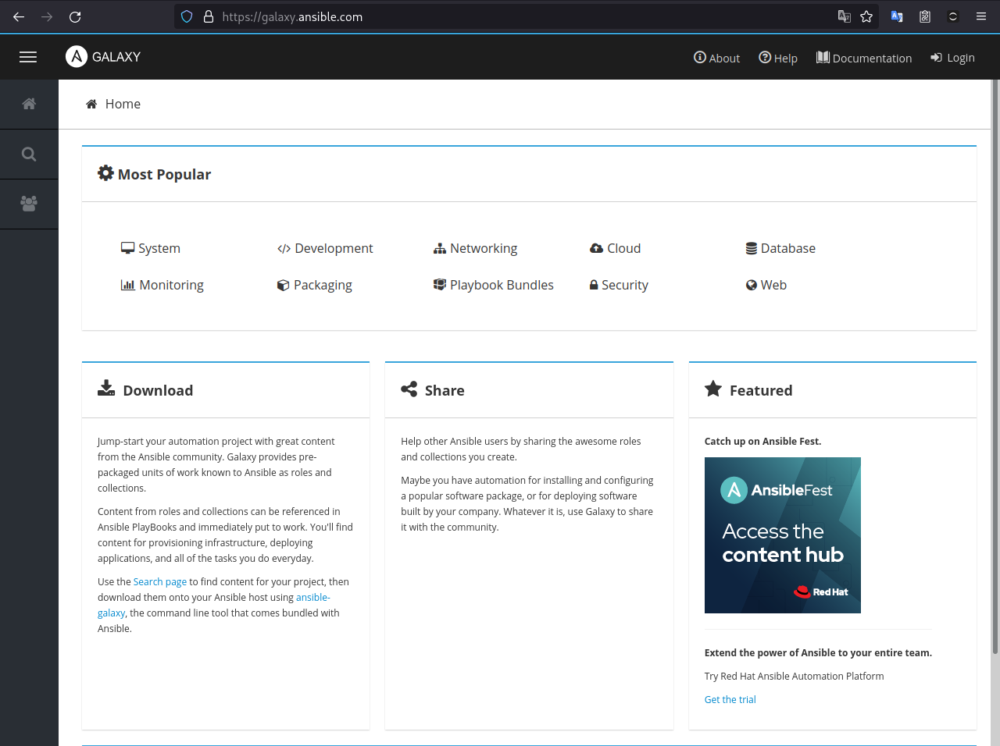

# Ansible Galaxy

Como vimos o nome Ansible vem da história do `mundo de Rocannon` na história de Ursula K. Le Guin. Rocannon é um antropólogo que precisa se comunicar com outros planetas usando o Ansible.

O Ansible Galaxy é uma forma de compartilhar receitas com outras pessoas usando Ansible. Você pode acessar o Galaxy nesse [link](https://galaxy.ansible.com/)



Existem diversas receitas e módulos prontos e feitos pela comunidade que podemos explorar e instalar em nosso nó controlador para automatizar tarefas de forma mais eficiente.

## Instalando um módulo

Uma coisa que gosto bastante no meu ambiente pessoal é de instalar diversas versões do python. Isso me ajuda a trabalhar melhor e testar código em diversas versões do python. O Ansible, porém, não conta com um módulo nativo para lidar como o [pyenv](https://github.com/pyenv/pyenv) que é um instalador de versões do python.

Para isso, podemos contar com o Galaxy. Uma pessoa da comunidade criou um pacote para gerenciar o [pyenv](https://galaxy.ansible.com/staticdev/pyenv).

Para instalar essa role temos que o usar o comando `ansible-galaxy`:

```bash title="$ Execução no terminal"
ansible-galaxy install staticdev.pyenv
```

> `staticdev` é o nome do perfil da pessoa que criou o pacote para o galaxy

```bash title="Resposta do terminal"
Starting galaxy role install process
- downloading role 'pyenv', owned by staticdev
- downloading role from https://github.com/staticdev/ansible-role-pyenv/archive/2.6.2.tar.gz
- extracting staticdev.pyenv to /home/vagrant/.ansible/roles/staticdev.pyenv
- staticdev.pyenv (2.6.2) was installed successfully
```


## Usando o módulo

Agora que temos a role do pyenv podemos incorporar ela em nossos playbooks. Vamos reescrever as tasks que instalam e configuram o pyenv. Pois tudo aqui é feito de forma automatizada:

```yaml title="play_tasks.yaml"
---
- name: Configura o ambiente de desenvolvimento
  hosts: linux
  gather_facts: true


  tasks:
    - name: Dependências de desenvolvimento
      become: true
      import_tasks: tasks/dev_env.yml

  roles:
    - role: staticdev.pyenv
      pyenv_env: user
      pyenv_global:
        - 3.11.0
      pyenv_python_versions:
        - 3.11.0
```

### Role vs Task vs Collection!

TODO!

## requirements de Collections e Rules

Também podemos centralizar um arquivo com todas as nossas dependências. Para que seja mais simples o processo de instalação dos pacotes de terceiros do Galaxy. Vou chamar esse arquivo de `requirements.yml`.

Nele vamos instalar um gerenciador de pacotes para o arch poder baixar pacotes do [repositório AUR](https://aur.archlinux.org/). Que vem em uma coleção chamada `kewlfft.aur` e também vamos deixar a role do pyenv para ficar num arquivo único e centralizado:

```yaml title="requirements.yml"
collections:
  - name: kewlfft.aur
roles:
  - name: staticdev.pyenv
```

Agora com esse arquivo podemos instalar todas as collections de uma vez:

```bash tile="$ Execução no terminal"
ansible-galaxy collection install -r requirements.yml
```

E também podemos instalar todas as roles de uma vez só:

```bash tile="$ Execução no terminal"
ansible-galaxy role install -r requirements.yml
```

Dessa forma ficando mais simples de compartilhar nosso ambiente Ansible com outras pessoas :heart:
